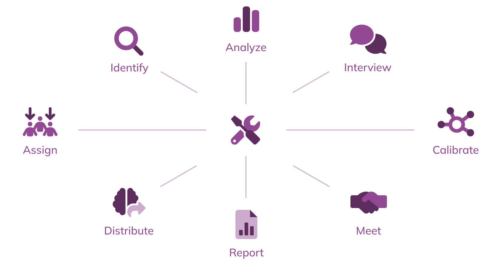

## Appendix A: Using the Starter Guide to adjust the Howie process to fit your organization
As mentioned at the start of this guide, the Howie process can be adjusted depending on the specific context of your team, your organization and the goals for introducing or improving an incident analysis program.  Here are two examples from companies that have adopted a Howie process:

### Large company developing their first company standard
BoomBox, Inc. was a large multinational company with a centralized dev tools team that sets the standard for how to do incident analysis within the company. While some individual development teams were already doing a brief root-cause analysis after an outage, the core group wanted to introduce a standardized incident review process to maximize the time spent in reviews. To give their dev teams some guidelines without being too prescriptive, they adapted the full Howie process to help their dev teams get started. They rolled out this adapted process to begin building the muscles of doing consistent reviews in a lightweight way.

As they get more buy-in, they plan to introduce more steps (the dotted lines) to their analysis process to get deeper insights, involve more of the company by interviewing, and focus on sharing the findings more broadly outside of involved teams.

### Mid-size company improving their existing practices
FastMover, Inc. is a growing company with a strong culture of continuous improvement among their many autonomous dev teams. The teams regularly hold post-incident reviews, but they wanted to get better at them by emphasizing collaboration and engagement. They adapted a Howie process to introduce analysis with Jeli, interviewing, and using the calibration document and training facilitator to make the most of their meetings.

## Appendix B: Introducing a new investigation process
Organizational change management is a critical aspect of introducing a new investigation process. Give your new process the best chance of adoption by communicating its intent, how it will impact the company and how the reader can provide support or get their questions answered. This aspect of introducing new practices could be its own guidebook! We encourage you to learn more about how to understand the needs of individuals and teams within your company, develop the practices to best support them, influence change and create sustainable performance improvements at your organization.

At a minimum, as you introduce this new process for the first time, have some verbiage and documentation ready to share, as folks may be unfamiliar with this new approach to incident analysis. We often use the following:

*We are improving the “after the incident” phase at $COMPANY and taking new approaches to the “after the incident” phase—specifically focusing on incident analysis (learning from incidents), and getting the most learnings we can out of incidents.*

*An important thing to remember is that we are at the beginning of how we handle the “after the incident” phase. What we’re doing with this phase now will help shed light on how we are doing as an organization and how we can improve.* 

*As we roll out more comprehensive investigations, you’ll notice they have the title “X” to specifically focus on how we got to this specific incident, including digging into historical incidents and decisions made at $COMPANY.*

### Q: What are the components of a strong incident analysis?
1. Incident occurs
1. Investigation assigned
1. Investigation accepted
1. Initial analysis by investigator to identify interviewees and insight generation
1. Investigator analysis of disparate sources
1. Individual interviews
1. Calibration document (align with participants on the event)
1. Facilitated post-incident meeting
1. Report/incident dissemination
1. Action items meeting or document

*If you have any questions on what we’re doing/what the plan is (in the meantime), please reach out to @$PERSON and we can chat.*

## Appendix C: Handling Concerns & Objections
These are some frequently asked questions you might get when sending out any communications on your investigation process changes.You can edit and adjust these to match your company’s needs, then make this a pdf and attach it to an email or share it internally.

**This is a much more thorough and clearly interesting approach than what we have been doing, but how will this new approach to incident analysis scale? Doing this sort of investigation takes much more time than we’re used to—we can’t possibly spend this much time doing it for every incident we have!**

Yes, doing a strong incident analysis for each and every incident that occurs at $COMPANY wouldn’t be feasible! But there are two parts to this answer:

- Taking this different approach to analyzing incidents will get easier and more efficient over time because doing this involves expertise. Doing this work effectively is the same as with software development—a more experienced engineer can write more valuable code in less time than a novice engineer.
- Different incidents warrant different levels of analysis. Incidents are much more unique than they are typically understood to be. Therefore, the time/attention/effort to analyze them should be relative to their potential to reveal insights about $COMPANY’s practices, systems, history, expertise, etc.

In other words, we don’t want, nor need, to do the same level of analysis for every incident. The challenge we face is to develop the skills to recognize which incidents have a greater potential to reveal valuable insights and which ones don’t. For those that do, we’ll squeeze as much as we possibly can out of them. For those that don’t, we won’t.

**What are elements or qualities of an incident that signal high potential value and warrant a “stronger” investigation?**

There is no prescriptive formula for this, and we will get better at recognizing these as we become more experienced, but here are some examples of incidents that might deserve more attention (this is not a complete list!):

- There were multiple (> 2) teams involved
- A new service or interaction took part in the event
- It involved misuse of something that seemed simple or uninteresting (hint: there’s usually more to dig into here (e.g., expired certs)
- The event involved a use case that was never thought of—indication of a surprise
- The event was almost really bad
- It looks like a repeat incident
- There is a lot of discussion around the incident
- There was confusion in or around the event
- The incident took place during an important event (e.g., an earnings call)
- There is an interest in investigating it further (there is no prescriptive formula for this)

**What’s the story with follow-up/action items in this new way of doing things?**

All incidents produce an organizational drive for ‘improvement’ and our company is no exception to this. As Todd Conklin of The Pre-Accident Investigation podcast said, “The problems begin when the pressure to fix outweighs the pressure to learn.”

Research has shown that when action items generated in a post mortem meeting they can distract from exploring and understanding the event in a more valuable way and are often rushed and not fully thought out. As a result, many action items are either dismissed, completed but not valuable, or forever remain on a backlog because, upon some further reflection (“soak time”), people who initially suggested them may realize that they were not likely to produce the effect they intended when they came up with them.

After separating the creation of action items from the learning part of the meeting itself, the postmortem meeting is then dedicated to developing a deeper and better understanding of the incident, and attendees commit to taking some (short!) time to consider what countermeasures or action items are likely to be genuinely valuable. The collection/collation of these ideas can even be done asynchronously in a day or two after the group meeting.

It’s recommended to remind attendees at the beginning of meetings to keep a running list of notes about potential action items as the meeting unfolds and use these notes as fuel for dialogue with their teammates and consideration for formalizing them after the meeting.

**What happens if my team is involved in an incident that is chosen to be analyzed via this new way?**

All of the people involved in the incident will be engaged in both the preparation for the post-incident meeting and the resulting document based on that meeting. The people involved in the incident will still be involved in this process and will be actively consulted to ensure that the artifacts the investigators produce are technically accurate and that people involved in the incident are being well-represented. Generally speaking, what you can expect might happen includes:

- 1:1 interviews between an investigator and an incident responder (or someone related to the incident). The investigator might ask you questions like: What happened from your perspective? How was it noticed? How was it handled?
- All of these questions will be asked with the goal of understanding what happened and how we got here.
- All people involved in the incident or experts in a system involved in the incident will be contacted after the initial analysis from the investigators. This contact will be done prior to the postmortem meeting to ensure that what the investigators are understanding is technically correct.
- All people involved in the incident will be invited to the postmortem meeting and are encouraged to participate and contribute to the discussion—this is not a presentation, but rather an opportunity to learn more about the incident and develop a deeper understanding of the events leading up to it and the themes that the event brings up.
- The postmortem meeting provides a forum to discuss some of these themes.
- The investigators will come up with a report. The report will be shared with folks involved in the incident prior to sharing it more broadly—the folks involved have the opportunity to engage with the report, shape the report, and use the report as a way to stimulate discussion about potential action items that they may want to add (even after the report is published).