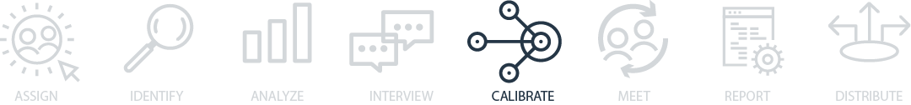
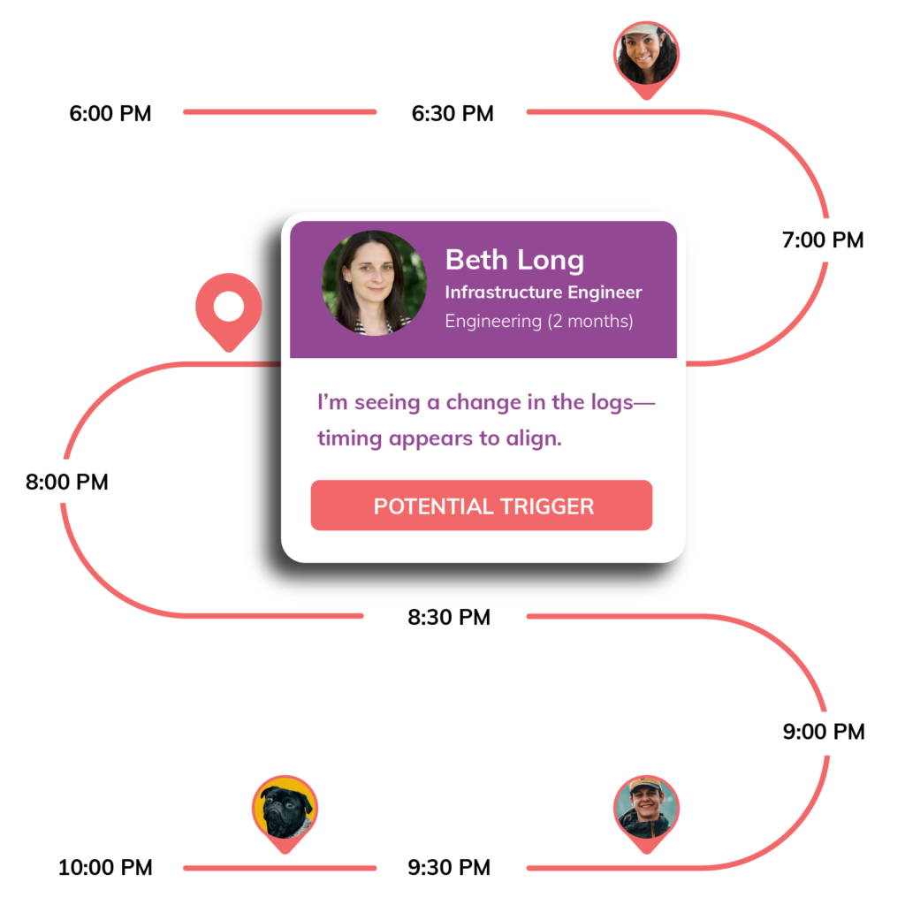

## Calibrate on your analysis
After you’ve consolidated all your incident and interview data, you’ll want to calibrate with your interviewees and incident participants to make sure you captured their input properly and there are no surprises during your meeting. You may do this by sharing your initial findings through sharing of notes or documents (including a draft of the incident report; we call this a “calibration document”).

Doing this gives everyone a chance to clarify their mental models as well as make additions or corrections to your investigation.

## The incident write-up or “calibration document”
We use a calibration document as a way of aligning with participants of the facilitated meeting about the event. This is not a final report; it is an interim findings document for interviewees to give the investigators feedback on the analysis and themes so far and comment on other topics that they’d like to include in the incident review meeting. This document can be used to start the final report.

The calibration document contains some information about what data has been reviewed to date, who has been interviewed, and what themes have emerged from this effort.

It should be shared in advance of the facilitated learning review to participants to add their comments and questions, which can help focus the meeting.

As you go through the analysis process, you’ll have lots of different pieces of raw data. You might have transcripts from chat, some interviews, or maybe some service logs. By itself, raw data doesn’t tell the story of what happened. That’s where an investigator comes in—to consolidate the data. This is typically something you do while you’re also collecting data and interviewing. Ultimately, you’ll consolidate data in a few different ways. First, you’ll start by identifying key themes, then you’ll use what you’ve found to help build a visualization, and finally, you’ll be able to refine that into a written document that will contain your findings.

As you work through the initial review, you begin to form an idea of the event and important aspects of the technical or coordinative difficulties faced. You can begin consolidating key themes as soon as they emerge from the data.

## Consolidation of themes
Think of your themes as the topics of interest that surfaced throughout the investigation: what surprised you, what do you think others should know more about, what is shared among other incidents.

These can be aggregated in a collaboration document. You may find yourself with more themes than you will have time to review during the meeting; in this scenario, you can ask those involved in the incident ahead of time to help prioritize the top two to five themes to be discussed.

## Consolidation of data as visual representations
There doesn’t have to be just one timeline; in fact, you should create different timelines based on different points of view. For example, you might have different timelines that represent how different practitioners experienced the event.

In addition to point-of-view timelines, you should also build a narrative timeline. This timeline will show key moments in the event, which you can use to facilitate your incident review meeting. This timeline can include things like when the first alert happened, when the issue was escalated as a major incident, when experts were recruited, when troubleshooting steps were taken, when hypotheses were developed or disproved, when impacts were noticed or changed, and anything else that you feel helps tell the story of the incident. This will allow you to walk through that story while asking for feedback from those individuals involved.

## Consolidation of data in a write-up document
Many organizations use some form of incident write-up to communicate the findings of the investigations. These may be in a document or take place within another kind of software system (like JIRA or OpsGenie).

We see this as a two-part process: First, producing a calibration document, followed by a more complete “how we got here” document. The first document will be used to ensure folks are on a similar page coming to the learning review meeting, while the second document adds to it with the findings from it.

Make sure you give others sufficient time to review and reflect on the document so there are no surprises during the meeting itself. It may help to ask specific questions when sending out this document in order to prompt feedback (and avoid folks only briefly glancing at it before the review meeting). You may ask:

- I want to make sure I captured this part properly; will you please review and let me know your thoughts?
- Are there any items that are missing from this document that we should discuss?
- Is this technical detail correct?