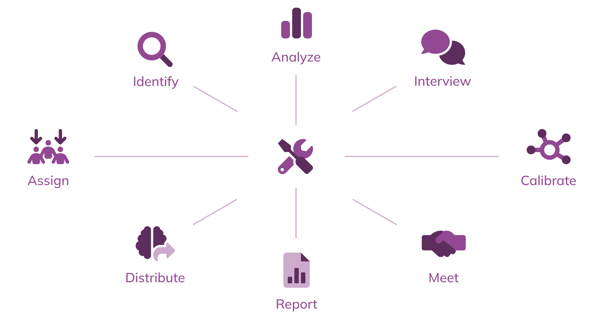

The Howie Guide to Post-Incident Investigations was originally published by Dr. Laura Maguire, Nora Jones, Vanessa Huerta Granda in collaboration with the Jeli team. PagerDuty acquired Jeli in 2023 and we're proud to rehome the Howie Guide as a part of the PagerDuty Ops Guide library.

## Welcome to the Howie Guide to post‑incident investigations!

The guide you’re about to read will provide you with an explanation of how to get the most out of your incidents. This process has been developed by a number of leading experts in the field and shows the steps to conduct an in-depth investigation.

We affectionately call this process the “how we got here process” (or “Howie process” for short), and it is applicable to companies of different sizes and stages of maturity with investigation programs.

### Why focus on learning from incidents?
Recent events have shown how critical digital services are to individuals, organizations and society as a whole. Now more than ever, learning from incidents is crucial to helping maintain service reliability requirements so companies can continue delivering on their commitments to clients and keep employees connected and productive

As Nora Jones notes:

> We’re at an age in software where learning from incidents is pivotal to our companies’ continued successes. There is a massive opportunity for Software Engineers to learn more about the applications of Resilience Engineering, Human Factors, and Systems Safety to their everyday work with the goal of learning how we can extract value and build expertise from incidents and surprises.[1](https://howie-guide.pagerduty.com/authack/)

When we think about learning from our incidents, we often don’t have a good framework for what we can get out of this work. As noted cognitive psychologist and researcher Gary Klein explains in his book on human performance in everyday work conditions.[2](https://howie-guide.pagerduty.com/authack/)

!!! tip
    Performance Improvement = Error Reduction + Insight Generation

So far, the industry has over-indexed in the “error reduction” part of the equation by emphasizing incident metrics like mean time to respond and not much on generating insights. By investing in learning and in generating quality insights from each individual incident, you will be able to provide context around your incident metrics and show a more complete picture of performance improvements.[3](https://howie-guide.pagerduty.com/authack/)

This guide provides some concrete strategies to help you begin to develop skills in generating insights and to help your company in developing an incident analysis program. It will start by walking you through the stages of an investigation: how to assign and accept an investigation, identify your incident data for analysis, prepare for interviews, and write a calibration document. As you wrap up your investigation, you will also learn how to lead a learning review meeting, complete an incident report, and integrate any additional findings and action items before you finalize and distribute your learnings within your organization.

While the steps outlined here represent a well-rounded way to review an investigation, our research shows that:

1. Every organization has different needs, strengths, limitations, and goals for their incident investigation process, so some of the steps may not be applicable to every organization.
2. Many investigators have constraints on how much time they can spend on an investigation, and some investigators are currently the only ones doing investigations, so it has to be efficient.
3. Incidents have differing levels of value for investigating incidents. Fundamentally, we believe you can learn from every incident but, realistically, we know that organizations are balancing tradeoffs between time spent in development or operations versus time spent in learning.

This means that an investigation process needs to be flexible and adaptable to the goals, interests and needs of the team or organization. We built Howie to be customizable for different sizes of organizations, skills of investigators, or levels of severity of incidents.

In this way, an investigator should think about this process as a set of tools in a toolbox. As you progress as an investigator and your company progresses with its incident investigation program, we encourage you to seek more tools to add! This will help you increase the number of insights gained in your investigations.

At the start of each investigation, you’ll consider how much time you have, the availability of participants, and how much value the findings from the investigation will have for the company. High severity, very public events, or substantial near misses would use more of the tools provided here. We encourage you to take the parts that make sense to you at this specific time.

What we hope you take away from this is how to structure your post-incident processes and train others on them. We believe our guide will set you up for success in helping your workplace become a learning organization, one investigation at a time.

—Your friends at Jeli

## A brief word about language in incident investigations
We introduce a number of terms in this guide that may be different from what is used in your organization. Generally speaking, we believe that getting the process right is more important than arguing over language. At the same time, many of the legacy terms used in the industry (such as “post-mortem,” “root-cause analysis,” etc.) come with a history of negativity. Using positive, specific language (such as “learning review” or “blame-aware”) is an important piece of building a culture of learning where folks are excited to be part of this transformation. We believe that language will always be evolving; in this guide we use a number of terms interchangeably (“incident investigation” and “incident analysis”) to reflect the way we use different terminology in our day-to-day work. We expect future iterations of this guide to present new terms and retire some of the ones we see here.

## Glossary
**Blame-aware** – An evolution from “blameless,” we recognize that everyone works with constraints and sometimes those don’t appear until after an incident; we acknowledge our tendency to blame and name names and move past it in order to be productive.

**Investigator** – The person who will own the responsibility for the investigation all the way through the process (from initial analysis through distribution of findings); we outline a number of recommendations for what makes someone a good candidate for this role.

**Knowledge elicitation** – The process of gathering an expert’s tacit knowledge (expertise and experience) underlying their performance. This is a sub-process of knowledge acquisition.

**Calibration document** – A document of initial findings put together by the investigator that will be shared prior to a review meeting to ensure proper alignment with interviewees and participants. This document should prevent any surprises from coming up during the review meeting. A calibration document can also be a draft to the final incident report.

**Incident report/ how we got here report** – A document to be sent out following the review meeting to all participants. This should be a learning document different from a post-mortem report in that its goal is learning. It is focused on the story of what happened and how events came to be.

**Review meeting** – A facilitated meeting where the investigator guides participants through the incident in order to uncover and share insights.

**Action items meeting** – A facilitated meeting or section of a meeting to focus on follow-up items uncovered during the investigation and where you can generate and assign any next steps.
