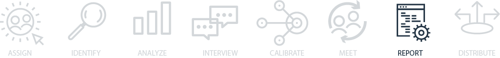

## Report your findings
It’s time to generate a final report that will remain the organizational record of the event. If you’ve followed other processes before, like the “5 Whys” or the Google SRE model, you may feel like you’ve already done this, but there’s a difference. Here, you’ll be putting together a report that tells the story of how things unfolded, or “how we got here.”

When reports are one-dimensional, just a set of facts from a single point of view, they can be hard to learn from. We take a narrative approach to presenting the contributing factors to the event, background on the technology involved—including important historical context—and details about how the incident coordination was handled. It describes both the technical failures and the social and organizational processes involved.

Going beyond what broke and taking a broader view can make the investigation relevant to more people across different roles in the organization. For example, customer support can learn about what information is useful to provide during an incident or new engineers can get valuable background as part of their onboarding.

## Generate your “how we got here” report
So far, you’ve gathered data from multiple sources, consolidated it by extracting themes, created a visualization, and possibly even done some interviews. You’ve created a calibration report that represents the story of how the event unfolded from multiple perspectives. Now is the time to finalize the findings from your investigations. Many organizations have a formal report they generate after an incident. We suggest creating a “how we got here” document that is sent out to all the participants.

A “how we got here” is different from a standard postmortem in that it is primarily focused on the story of what happened and how the events came to be. The goal with a “how we got here” report is to learn from the incident. This template was developed with our colleagues at Netflix, Slack and Adaptive Capacity labs.

You may choose to start this document from your calibration document and add to it after your meeting.

[You can find an example of the How We Got Here Investigation Report here](assets/HowWeGotHereReportGuide.pdf)

## Iterating on the report throughout the investigation
A key aspect of your role as an investigator and incident analyst is to ensure multiple perspectives are well represented in the finished product. This means integrating feedback from the calibration document and individual follow-ups so the comments are accounted for. Throughout your investigation you’ll be collecting information to continuously update the document to include clarifications, feedback, new information, and important learnings from the review meeting.

Some organizations focus more heavily on the meeting and less on a written report. If this is your organization, you will still want to include a short overview in the document and link to a recording of the meeting, if available, to leave a record of your work and the subsequent discussions.

In addition, the action items should be added to this document to provide a consolidated view of what follow-ups are needed and help future readers to follow the full scope of the event and its outcome.

We recommend tracking analytics for the document. Seeing who is reading it and how often or how long after the event can provide lots of valuable insight into what is useful for the organization. You’ll also be able to see where your distribution is working well and where it could be improved, which we’ll tackle in the next section.
